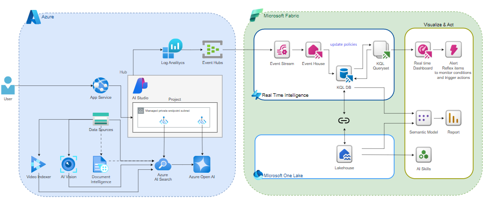
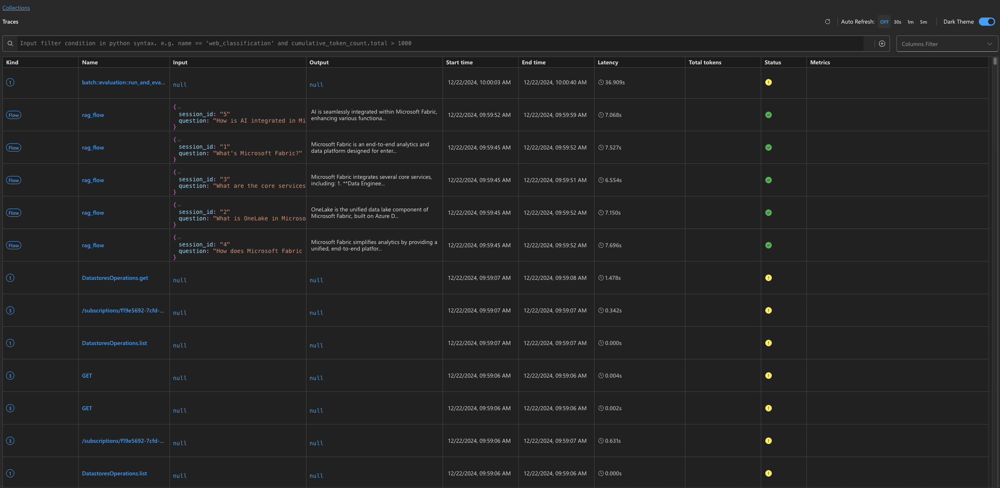
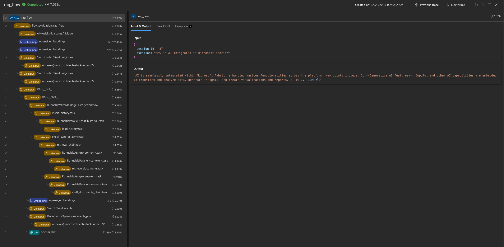

# Methodology of developing and evaluation LLM-based applications
###  
## Intro 

When developing LLM-based applications, common questions include:

1. How to develop LLM-based applications?
2. How to evaluate their quality?
3. How to monitor them?

This project provides best practices and real examples based on production experience for the aforementioned questions.

## Methodology Steps

#### Evaluation Datasets 

When planning your evaluation strategy, start by preparing evaluation datasets. 
The data sets emulate your actual interaction with LLM or with LLM based Agent.

Keep these points in mind:

    - Domain experts should prepare the data sets.
    - Tailor the data set structure to your use case.
    - Start with a small size of 20-30 samples of your flow.
    - Regularly update data sets with real production examples.
    - For a multi-agent system, create a dedicated dataset for each agent.

For example the evaluation data set for conversational flow, could have the following schema:

`question, ground-truth, context, chat-history`

`question` is the question asked by the user.
`chat-history` is a list of previous questions and answers.
`ground-truth` is the expected answer.
`context` is the context for the question, retrieved from the search index.

Example:
```json
{
    "session_id": "1",
    "question": "What's Microsoft Fabric?",
    "ground-truth": "Microsoft Fabric is an end-to-end analytics and data platform designed for enterprises that require a unified solution. It encompasses various services such as Data Engineering, Data Factory, Data Science, Real-Time Analytics, Data Warehouse, and Databases. Fabric integrates these components into a cohesive stack, simplifying analytics requirements by offering a seamlessly integrated, user-friendly platform. Key features: Unified data storage with OneLake, AI capabilities embedded within the platform, Centralized data management and governance, SaaS model.",
    "context": "Microsoft Fabric is an end-to-end analytics and data platform designed for enterprises that require a unified solution. It encompasses data movement, processing, ingestion, transformation, real-time event routing, and report building. It offers a comprehensive suite of services including Data Engineering, Data Factory, Data Science, Real-Time Analytics, Data Warehouse, and Databases. With Fabric, you don't need to assemble different services from multiple vendors. Instead, it offers a seamlessly integrated, user-friendly platform that simplifies your analytics requirements. Operating on a Software as a Service (SaaS) model, Fabric brings simplicity and integration to your solutions."
}
```


#### Manual Evaluation

With an evaluation dataset, you can perform manual evaluations to validate the LLM, model parameters, and prompts. This process helps ensure your idea works and is crucial step in developing LLM-based applications. 
Azure AI Foundry offers a Manual Evaluation tool. 

#### Evaluation Metrics 

Decide about evaluation metrics you want to measure.

For conversational flows, consider using metrics such as `*relevancy*`, `*similarity*`, and `*groundedness*`.
For summarization tasks it could be `*similarity*` metric.
The relevant metrics for a evaluation depend on your use case.
Consider assigning greater weights to more significant metrics according to your workflow. 
Calculate an aggregated score using these weights.
For instance, if standard phrasing is crucial in a model output, give higher weight to the similarity metric comparing ground truth and model answers.
In a multi-agent system, each agent may utilize a distinct set of evaluation metrics.
In this project, we utilize the [Azure Evaluation SDK](https://learn.microsoft.com/en-us/azure/ai-studio/how-to/develop/evaluate-sdk), which includes a variety of built-in evaluation metrics.

#### 
#### Automatic Evaluation Implementation

Incorporate automatic evaluation into your project.
The implementation depends on your flow. For conversational flows, another advanced model is typically needed for evaluation, the judge model.
The project in this repo uses the [Azure Evaluation SDK](https://learn.microsoft.com/en-us/azure/ai-studio/how-to/develop/evaluate-sdk) and [Azure AI Foundry Evaluator Library](http://ai.azure.com/), which offers ready prompts specifically designed for evaluations.
Integrate automatic evaluations into your CI/CD pipeline. Fail the build if metrics drop below predefined quality thresholds.

#### Running Evaluations

Run evalations during development and in CI/CD.
In this project, we use the [Azure AI Foundry Prompt Flow SDK](https://github.com/microsoft/promptflow) to run automatic evaluations on the evaluation data set.


#### Monitoring 

Monitoring is a crucial part of any LLM-based project. It should be designed and implemented from the beginning, rather than postponed to the final phases. 
In this project, we collect data from the RAG Agent, including tokens, model parameters, and evaluation metrics. This data is crucial for cost calculations and quality analysis of LLM-based applications, helping determine the impact of changes like prompts, model parameters, or models on application quality.
In this project, we use the [promptflow-tracing](https://pypi.org/project/promptflow-tracing/) package to collect application traces. 
Prompt Flow tracing follows the Open Telemetry Standard.


#### Local Development

To facilitate local development, we utilize Visual Studio Code. The Prompt Flow extension in VS Code simplifies several aspects of local development. For instance, it offers tools to run RAG locally and collects Open Telemetry traces on a local level. 
It is also worth mentioning that we use the [Prompt Flow Flex](https://microsoft.github.io/promptflow/tutorials/flex-flow-quickstart.html) flavor, which provides comprehensive development flexibility.

#### Agent Configuration

For each Agent, we create a configuration file in YAML format, which includes all mandatory settings such as prompts, LLM, model parameters, and more. Any modification to this configuration file results in a new revision. During the evaluation of the Agents, we record the current revisions in the logs. 
Logs are collected and analyzed in Microsoft Fabric.
This allows us to compare the evaluation metrics for each Agent and determine how specific configuration revisions affect their performance. 


## 
## Project Description
The primary objective of the project is to illustrate the methods for monitoring and evaluating LLM-based applications. It showcases the functionality of Retrieval Augmented Generation (RAG), placing emphasis on monitoring and evaluation while also addressing certain aspects of local development.


- **aimodel**: A wrapper on top of LLM models.
- **aisearch**: A wrapper for search functionality utilizing the Azure AI Search service.
- **evaluation**: This module calculates conversation metrics such as Groundedness, Relevance, Similarity, and Coherence using the Azure Evaluation SDK.
- **rag**: Implements the RAG agent, the project's core component. This is a conversational bot, allowing you to ask questions on top of your documents.
- **data_ingestion**: A utility that allows uploading PDF documents and indexing them into Azure AI Search. The RAG Agent uses AI Search to retrieve relevant context for each user question. This module uses the Azure Document Intelligence service to semantically chunk the PDF documents and convert the chunks into Markdown language for indexing in Azure AI Search.
- **msfabric**: This module encompasses a Real-Time LLM evaluation dashboard and KQL (Kusto Query Language) queries utilized for constructing the dashboard.
- **docs**: Project documentation.


#### Project Services and LLM Frameworks 

- **Azure AI Foundry**: Model deployments, playground, and manual evaluations.
- **Azure AI Search**: Retrieval engine.
- **Azure Document Intelligence**: Documents semantic chunking.
- **Microsoft Fabric**: Observability and evaluation results analysis.
- **Langchain**: LLM framework with easy integrations with Azure AI Search and Azure Document Intelligence.


#### Architecture




#### Prerequisites
- **Azure AI Foundry project**
- **Azure AI Search service instance**
- **Azure Document Intelligence service instance**
- **Microsoft Fabric** (Trial could be used)
- **Visual Studio Code**
- **Python 3.11** (The project has been tested with Python version 3.11 on Mac)

#### Project Installation
1. Clone the project from GitHub:
    ```sh
    git clone https://github.com/vladfeigin/llm-agents-evaluation.git
    ```

2. Create a project folder and navigate to it:
    ```sh
    cd llm-agents-evaluation
    ```

3. Create a virtual environment in the root project folder:
    ```sh
    python3.11 -m venv .venv
    ```

4. Activate the virtual environment:
    ```sh
    source .venv/bin/activate
    ```

5. Install dependencies:
    ```sh
    pip install -r ./requirements.txt
    ```

6. Create a `.env` file from the `.env_template` file located in the project root folder:
    ```sh
    cp .env_template .env
    ```

7. Populate the `.env` file with values pertinent to your environment.

#### Ingest your documents to search index

In this step, you will ingest your PDF documents to a new Azure AI Search index.

1. Copy the PDF files into a local folder.
2. Change the directory to the project’s data_ingestion folder.
3. Run: 
    ```sh
    python semantic_chunking_di.py --index_name <index name> --input_folder <folder name with the documents>
    ```
After ingestion, open Azure AI Search and verify the new index is created correctly and contains your documents.

#### Running RAG Agent locally

1. Change the directory to the project root folder: `rag_evaluation` folder.
2. In `./rag/rag_agent_config.yaml`, change the search index name to the newly created index name from the previous step.
3. From the command line, run:
    ```sh
    pf flow serve --source ./ --port 8080 --host localhost
    ```
    This will open a chat web interface. Now you can ask questions about the ingested documents.
4. Open Prompt Flow local traces: `http://localhost:23337/v1.0/ui/traces/` generated by the previous step.

    
    
    


5. Open Microsoft Fabric Real-Time dashboard. Select Ongoing Page and see the details of using RAG agent.


#### Running RAG Agent evaluation
1. Replace the `./rag/data.json` file with your relevant dataset. This dataset is for RAG Agent evaluation.
2. Once you have created a relevant dataset, execute the command from the command line:
    ```sh
    python -m ./rag_evaluation/runflow_local
    ```

### Observability with Microsoft Fabric

![Fabric][def]


[def]: rag_evaluation/docs/Fabric%20Observability.md