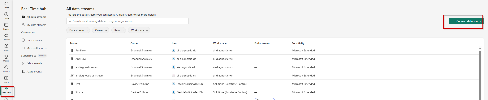
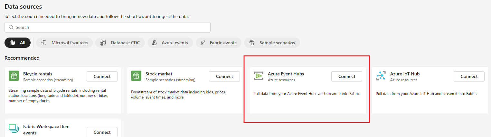
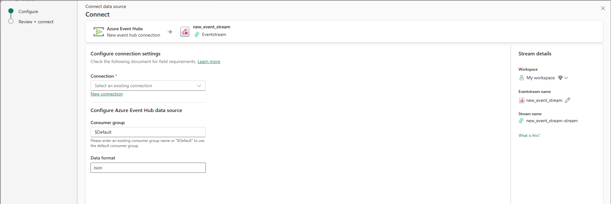
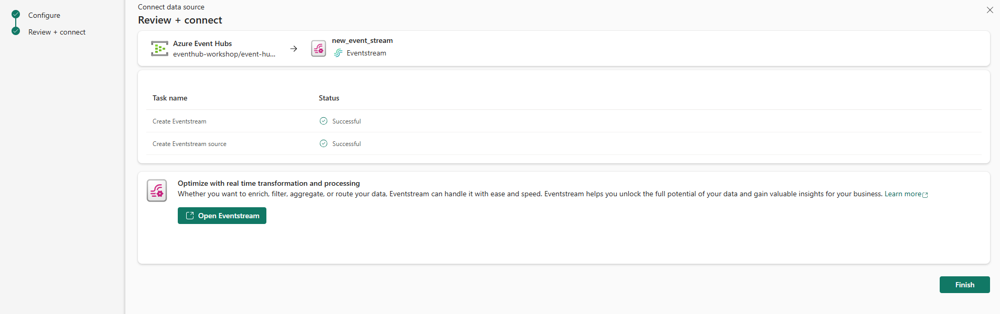
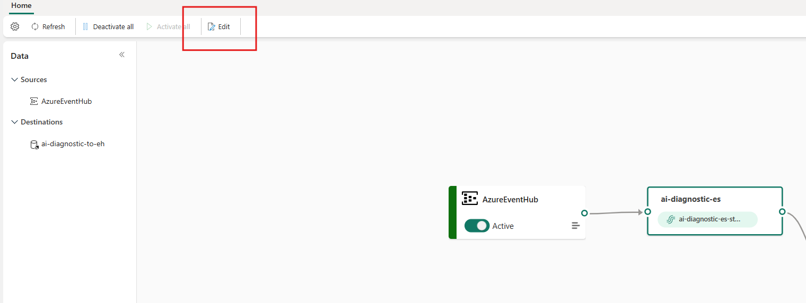
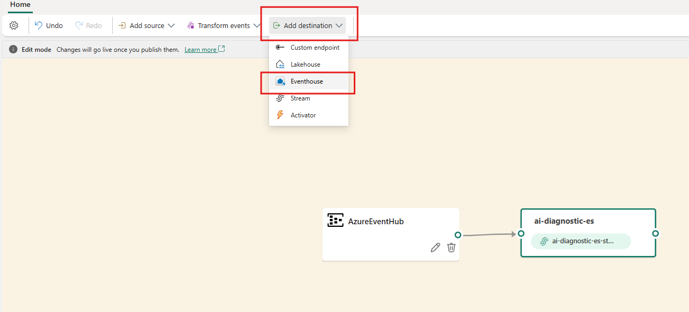
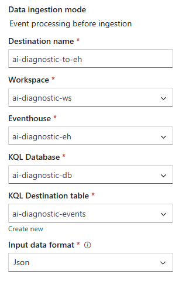
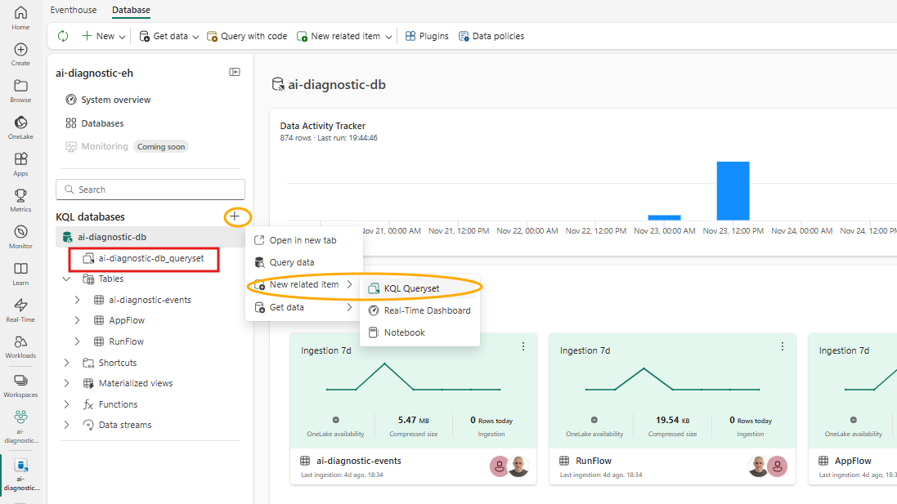
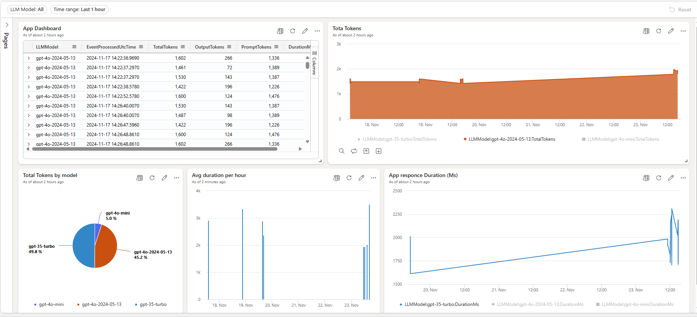
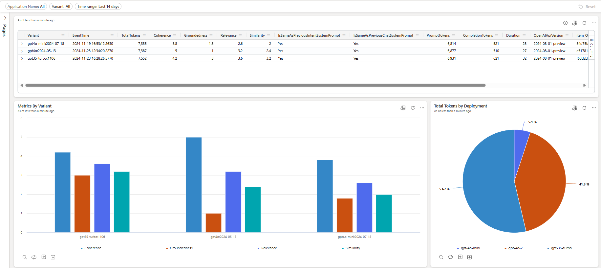

# Fabric AI Observability & Evaluation

## Overview

The **Fabric** is a Microsoft SaaS platform it's a solution to enhance data observability and troubleshooting . It provides:

- **Tracing**: Trace your application's runtime and data pipelines using advanced telemetry-based instrumentation integrated with Microsoft Fabric's tools.
- **Evaluation**: Leverage built-in analytics and AI capabilities to benchmark application performance using custom evaluations and metrics, enabling deeper insights into system performance.
- **Datasets**: Create and manage versioned datasets within the Microsoft Fabric Lakehouse for experimentation, evaluation, and machine learning model fine-tuning, supporting end-to-end workflows.

Fabric seamlessly integrates with Microsoft’s ecosystem, offering a comprehensive suite of tools such as Real-Time Analytics, Data Activator for alerting, and KQL Queryset for advanced querying. 
It provides robust features for organizations looking to build, deploy, and monitor secure and scalable solutions, all within a unified platform.

## Fabric Observability solution Architecture


This solution contains:

- Ingest, capture and route real-time events using **Event Streams** 
- Route events into **Eventhouse**
- Split data using table **update policy**
- Create a **KQL query**
- Create a **Real-Time dashboard**
- Explore data visually in the **Real-Time dashboard**
- Set an **alert** on the eventstream or Real-Time dashboard
  
## End to end tutorial

### Prerequisites

To successfully complete this tutorial, you need : 

- **Microsoft Fabric** [workspace](https://learn.microsoft.com/en-us/fabric/get-started/create-workspaces) with enabled [capacity](https://learn.microsoft.com/en-us/fabric/enterprise/licenses) or [trial capacity](https://learn.microsoft.com/en-us/fabric/get-started/fabric-trial). 
- **Azure Event Hubs** Stream to event hub collected traces, evaluation metrics and logs. [Stream to an event hub](https://learn.microsoft.com/en-us/azure/azure-monitor/essentials/create-diagnostic-settings?tabs=portal). 


### Create an eventhouse

1. Browse to the workspace in which you want to create your tutorial resources. You must create all resources in the same workspace.
1. Select **+ New item**.
1. In the **Filter by item type** search box, enter **Eventhouse**.
1. Select the Eventhouse item.
1. Enter *Tutorial* as the eventhouse name. A KQL database is created simultaneously with the same name.
1. Select **Create**. When provisioning is complete, the eventhouse **System overview** page is shown.

**Related content**

[Create an eventhouse documentation](https://learn.microsoft.com/en-us/fabric/real-time-intelligence/create-eventhouse)


### Ingest, capture and route events to Eventhouse

- **Create an eventstream**

Select **Real-Time** on the left navigation bar.
Select **+ Connect data source** in the top-right corner of the page. 



On the **Data sources** page, select **Azure Event Hubs** category.


   
On the **Connect** page, create **New connections**, in the opened window, do these steps:
  - Enter the name of the Event Hubs namespace.
  - Enter the name of the event hub.
  - For Connection name, enter a name for the connection to the event hub.
  - For Authentication kind, confirm that Shared Access Key is selected.
  - For Shared Access Key Name, enter the name of the shared access key.
  - For Shared Access Key, enter the value of the shared access key.
  - Select Connect at the bottom of the page.

   

After the connection and the eventstream are created successfully, you see the following updated **Review + connect** page.
      
   

Select **Open Eventstream**.

- **Create a destination**
         
From the menu ribbon, select **Edit**. The authoring canvas, which is the center section, turns yellow and becomes active for changes.

      

Select Publish on the ribbon.

In **Edit** Mode select **Destinations** > **Eventhouse**.
    
 

Enter the following information in the **Eventhouse** pane:

 

Ensure that the box **Activate ingestion after adding the data** is checked.
Select **Save**.
From the menu ribbon, select **Publish**.

   The eventstream is now set up to transform events and send them to a KQL database.

**Related content**

* [Create an eventstream](https://learn.microsoft.com/en-us/fabric/real-time-intelligence/event-streams/add-source-azure-event-hubs?pivots=enhanced-capabilities)
* [Add a KQL database as a destination](https://learn.microsoft.com/en-us/fabric/real-time-intelligence/event-streams/add-destination-kql-database?pivots=enhanced-capabilities)


### Split data usin table update policy

1. Create a target table:
   ```bash
   .create table 
    RunFlow (EventTime: datetime, item_OperationId: guid, item_ParentId: string, AgentName: string, ConfigVersion: string, ModelName: string, ModelVersion: string, ModelDeploymentName: string, OpenAIAPIVersion: string,Deployment: string, TotalTokens: long, PromptTokens: long, CompletionTokens: long, Duration: long, Temperature: string, Seed: long, SearchType: string, SearchTopK: long, IntentSystemPrompt: string, ChatSystemPrompt: string,Coherence: real, Groundedness: real, Relevance: real, Similarity: real, IsSameAsPreviousIntentSystemPrompt: string, IsSameAsPreviousChatSystemPrompt: string
    )
   ```  

2. Create a query:
   ```bash 
      .create-or-alter function RunFlowInsert() {
     let AppTracesTbl = 
        traces_table
        | extend item = parse_json(records)
        | mv-expand item
        | serialize
        | extend RowNumber = row_number(1, prev(PartitionId) != PartitionId) 
        | where item.Type == "AppTraces" 
        | where todatetime(EventProcessedUtcTime) >= todatetime ("2024-11-29")
        | project
            EventProcessedUtcTime,
            PartitionId,
            RowNumber,
            item,
            metricName = item.metricName,
            Target = item.Target,
            Type = item.Type,
            PropertiesPayload = dynamic_to_json(item.Properties.payload);
     AppTracesTbl
    | project
        item_time = todatetime((item)["time"]),
        toguid(item.OperationId),
        tostring(item.ParentId),
        Message = dynamic_to_json(item.Message)
    | where Message has "batch-evaluation-flow-metrics"
    | extend parsed_json = parse_json(Message)
    | extend 
        AgentName = tostring(parsed_json.metadata.tags.run_configuraton.AgentConfiguration.agent_name),		
        ConfigVersion = tostring(parsed_json.metadata.tags.run_configuraton.AgentConfiguration.config_version),
        ModelName = tostring(parsed_json.metadata.tags.run_configuraton.AgentConfiguration.model_name),
        ModelVersion = tostring(parsed_json.metadata.tags.run_configuraton.AgentConfiguration.model_version),
        ModelDeploymentName = tostring(parsed_json.metadata.tags.run_configuraton.AgentConfiguration.model_deployment),
        OpenAIAPIVersion = tostring(parsed_json.metadata.tags.run_configuraton.AgentConfiguration.openai_api_version),
        IntentSystemPrompt = tostring(parsed_json.metadata.tags.run_configuraton.AgentConfiguration.intent_system_prompt),
        ChatSystemPrompt = tostring(parsed_json.metadata.tags.run_configuraton.AgentConfiguration.chat_system_prompt),
        Deployment = tostring(parsed_json.metadata.tags.run_configuraton.AgentConfiguration.model_deployment_endpoint),
        Temperature = tostring(parsed_json.metadata.tags.run_configuraton.AgentConfiguration.model_parameters.temperature),
        Seed = tolong(parsed_json.metadata.tags.run_configuraton.AgentConfiguration.model_parameters.seed),
        SearchType = tostring(parsed_json.metadata.tags.run_configuraton.AgentConfiguration.retrieval.search_type),
        SearchTopK = tolong(parsed_json.metadata.tags.run_configuraton.AgentConfiguration.retrieval.top_k),
        TotalTokens = tolong(parsed_json.metadata.properties.system_metrics.total_tokens),
        PromptTokens = tolong(parsed_json.metadata.properties.system_metrics.prompt_tokens),
        CompletionTokens = tolong(parsed_json.metadata.properties.system_metrics.completion_tokens),
        Duration = tolong(parsed_json.metadata.properties.system_metrics.duration)       
    | where isnotempty(AgentName)         
    | mv-expand result = parsed_json.result
    | extend metric = tostring(result.metric), score = toreal(result.score)
    | project-away Message, parsed_json, result
    | evaluate pivot(metric, any(score))
    | sort by item_time asc
    | extend PreviousIntentSystemPrompt = prev(IntentSystemPrompt)
    | extend IsSameAsPreviousIntentSystemPrompt = iff(IntentSystemPrompt == PreviousIntentSystemPrompt or isempty(PreviousIntentSystemPrompt), "Yes", "No")
    | extend PreviousChatSystemPrompt = prev(ChatSystemPrompt)
    | extend IsSameAsPreviousChatSystemPrompt = iff(ChatSystemPrompt == PreviousChatSystemPrompt or isempty(PreviousChatSystemPrompt), "Yes", "No")
    | project
        EventTime = item_time,
        item_OperationId,
        item_ParentId,
        AgentName,
        ConfigVersion,
        ModelName,
        ModelVersion,
        ModelDeploymentName,
        OpenAIAPIVersion,
        Deployment,
        TotalTokens,
        PromptTokens,
        CompletionTokens,
        Duration,
        Temperature,
        Seed,
        SearchType,
        SearchTopK,
        IntentSystemPrompt,
        ChatSystemPrompt,
        Coherence = coherence,
        Groundedness = groundedness,
        Relevance = relevance,
        Similarity = similarity,
        IsSameAsPreviousIntentSystemPrompt,
        IsSameAsPreviousChatSystemPrompt
  }
   ```  

3. Create a update policy:
   ```bash 
      .alter table RunFlow policy update
      @'[{ "IsEnabled": true, "Source": "ai-diagnostic-events", "Query": "RunFlowInsert()", "IsTransactional": true}]'
   ```  
4. Backfill existing data from SourceTable to TargetTable:
   ```bash 
    .set-or-append RunFlow <|
    RunFlowInsert()
   ```  


### Create a Real-Time dashboard from a KQL queryset

Open an existing KQL queryset or create new.

 

Write a query and Select Pin to dashboard.

 

**Related content**

* [Create a Real-Time Dashboard](https://learn.microsoft.com/en-us/fabric/real-time-intelligence/dashboard-real-time-create)
* [Create a Real-Time Dashboard from Queryset](https://learn.microsoft.com/en-us/fabric/real-time-intelligence/dashboard-real-time-create#add-tile-from-a-queryset)


### Explore data visually in the Real-Time dashboard

Monitoring is crucial to track system quality, detect anomalies, and provide developers with actionable feedback.
Collecting traces for each component, user interaction, latency, and token usage.

 

Analyze different evaluation metrics

 

**Related content**

* [Explore data in Real-Time Dashboard](https://learn.microsoft.com/en-us/fabric/real-time-intelligence/dashboard-explore-data)
